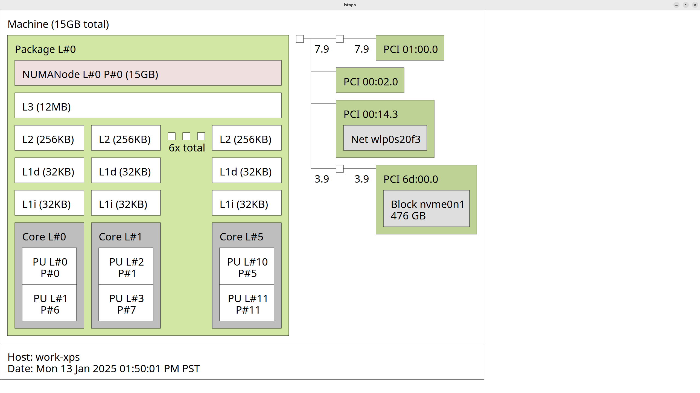
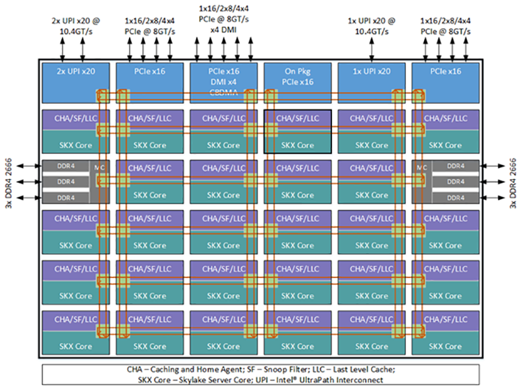
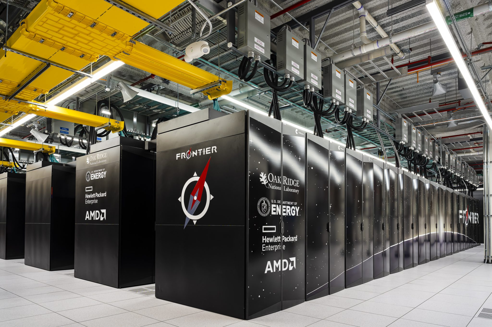

# 3) Introduction to Computer Architectures

Today:
1. Architectures
2. Memory


## 1. Architectures

### A [von Neumann Architecture](https://en.wikipedia.org/wiki/Von_Neumann_architecture):


The original document by von Neumann in 1945 describes a design architecture for an electronic digital computer with these components:

- A processing unit with both an arithmetic logic unit and processor registers
- A control unit that includes an instruction register and a program counter
- Memory that stores data and instructions
- External mass storage
- Input and output mechanisms

The term **von Neumann architecture** has evolved to refer to any _stored-program_ computer in which an instruction fetch and a data operation cannot occur at the same time (since they share a common bus). This is referred to as the _von Neumann bottleneck_, which often limits the performance of the corresponding system.

A stored-program computer uses the same underlying mechanism to encode _both_ program instructions and data as opposed to designs which use a mechanism such as discrete plugboard wiring or fixed control circuitry for instruction implementation.

The vast majority of modern computers use the same hardware mechanism to encode and store both data and program instructions, but have _caches_ between the CPU and memory, and, for the caches closest to the CPU, have separate caches for instructions and data, so that most instruction and data fetches use separate buses (_split-cache architecture_).

### A contemporary architecture:


### My laptop:

We can get this kind of information for our machine using [hwloc](https://www.open-mpi.org/projects/hwloc/), which provides a library as well as the command-line tool `lstopo`.

```bash
lstopo --output-format svg > lstopo-my_laptop_architecture.svg
```



### A double-socket compute node with two GPUs:

2x Xeon Ivy-Bridge-EP [E5-2680v2](https://ark.intel.com/content/www/us/en/ark/products/75277/intel-xeon-processor-e5-2680-v2-25m-cache-2-80-ghz.html) + 2x NVIDIA GPUs (from 2013, with hwloc v1.11).
GPUs are reported as CUDA devices and X11 display :1.0: (from the [hwloc gallery](https://www-lb.open-mpi.org/projects/hwloc/lstopo/))


### Block diagrams:

A block diagram from a vendor can include additional information about how cores are physically connected.

#### Ring bus (Xeon E5-2600 family):


#### Mesh bus ([Xeon Scalable family](https://www.intel.com/content/www/us/en/developer/articles/technical/xeon-processor-scalable-family-technical-overview.html)):



#### Multi-socket configurations:

A 4-socket ring configuration:


### Multiple nodes go into **racks** or **cabinets**




### Terminology:

* **Core** (virtual and physical): has a single program counter (logically sequential processing of instructions)
* **Memory channel**: e.g., DDR4-2400: transfers 64 bits (8 bytes) at a rate of 2400 MHz = 15.36 GB/s
* **Socket** or **CPU**: contains multiple cores in a single piece* of silicon
* **Non-Uniform Memory Access (NUMA)**: different channels may be different distances from a core
* **Compute node**: one or more sockets, plus memory, network card, etc.

## 2. Memory

### How expensive is it to access memory?

What does that mean?  How would we measure?

> #### Recommended Readings:
> - [McKenney (2013): Laws of Physics](http://www.rdrop.com/~paulmck/RCU/RCU.2013.01.22d.PLMW.pdf)
> - [Latency Numbers Every Programmer Should Know (Interactive)](https://people.eecs.berkeley.edu/~rcs/research/interactive_latency.html)
> - [Variation by vendor: Latency in AMD Memory Subsystems](https://www.anandtech.com/show/14694/amd-rome-epyc-2nd-gen/7)

### How your program accesses memory:

```c
double a[1000];

void foo() {
    for (int i=0; i<1000; i++)
        a[i] = 1.234 * i;
}
```

The compiler turns the loop body into instructions, which we can examine using [Godbolt](https://gcc.godbolt.org/z/gbhuZR).

```
pxor xmm0, xmm0                  ; zero the xmm0 register
cvtsi2sd xmm0, eax               ; convert the integer i to double
mulsd xmm0, xmm1                 ; multiply by 1.234 (held in xmm1)
movsd QWORD PTR a[0+rax*8], xmm0 ; store to memory address a[i]
```

Only one instruction here accesses memory, and the performance will be affected greatly by where that memory resides (which level of cache, where in DRAM).

Most architectures today have **64-byte cache lines**: all transfers from main memory (DRAM) to and from cache operate in units of 64 bytes.


### Let's compare three code samples

```c
for (int i=0; i<N; i++)
    a[i] = b[i];
```

```c
for (int i=0; i<N; i++)
    a[i] = b[(i*8) % N];
```

```c
for (int i=0; i<N; i++)
    a[i] = b[random() % N];
```

### What happens when you request a cache line?


### Operating system effects

Most systems today use virtual addressing, so every address in your program needs to be translated to a physical address before looking for it (in cache or memory).  Fortunately, there is hardware to assist with this: the Translation Lookaside Buffer (TLB).


### Further resources:

* [Julia Evans (2016): How much memory is my process using?](https://jvns.ca/blog/2016/12/03/how-much-memory-is-my-process-using-/)
* [Gustavo Duarte (2009): Cache: a place for concealment and safekeeping](https://manybutfinite.com/post/intel-cpu-caches/)
* [Gustavo Duarte (2009): Getting Physical With Memory](https://manybutfinite.com/post/getting-physical-with-memory/)
* [Ulrich Drepper (2007): What Every Programmer Should Know About Memory](https://www.akkadia.org/drepper/cpumemory.pdf)

### List of frequently found acronyms and abbreviations:

| Acronym | Meaning |
|:--------------------:|:-----------------------------:|
| ASCII | American standard code for information interchange
| ASIC | Application-specific integrated circuit
| BIOS | Basic input/output system
| BLAS | Basic linear algebra subroutines
| CAF | Co-array Fortran
| ccNUMA | Cache-coherent nonuniform memory access
| CFD | Computational fluid dynamics
| CISC | Complex instruction set computer
| CL | Cache line
| CPI | Cycles per instruction
| CPU | Central processing unit
| CRS | Compressed row storage
| DDR | Double data rate
| DMA | Direct memory access
| DP | Double precision
| DRAM | Dynamic random access memory
| ED | Exact diagonalization
| EPIC | Explicitly parallel instruction computing
| Flop | Floating-point operation
| FMA | Fused multiply-add
| FP | Floating point
| FPGA | Field-programmable gate array
| FS | File system
| FSB | Frontside bus
| GCC | GNU compiler collection
| GE | Gigabit Ethernet
| GigE | Gigabit Ethernet
| GNU | GNU (is not UNIX)
| GPU | Graphics processing unit
| GUI | Graphical user interface
| HPC | High performance computing
| HPF | High performance Fortran
| HT | HyperTransport
| IB | InfiniBand
| ILP | Instruction-level parallelism
| IMB | Intel MPI benchmarks
| I/O | Input/output
| IP | Internet protocol
| JDS | Jagged diagonals storage
| L1D | Level 1 data cache
| L1I | Level 1 instruction cache
| L2 | Level 2 cache
| L3 | Level 3 cache
| LD | Locality domain
| LD | Load
| LIKWID | _Like I knew what I’m doing_
| LRU | Least recently used
| LUP | Lattice site update
| MESI | Modified/Exclusive/Shared/Invalid
| MI | Memory interface
| MIMD | Multiple instruction multiple data
| MIPS | Million instructions per second
| MMM | Matrix–matrix multiplication
| MPI | Message passing interface
| MPMD | Multiple program multiple data
| MPP | Massively parallel processing
| MVM | Matrix–vector multiplication
| NORMA | No remote memory access
| NRU | Not recently used
| NUMA | Nonuniform memory access
| OLC | Outer-level cache
| OS | Operating system
| PAPI | Performance application programming interface
| PCI | Peripheral component interconnect
| PGAS | Partitioned global address space
| PLPA | Portable Linux processor affinity
| POSIX | Portable operating system interface for Unix
| PPP | Pipeline parallel processing
| PVM | Parallel virtual machine
| QDR | Quad data rate
| QPI | QuickPath interconnect
| RAM | Random access memory
| RISC | Reduced instruction set computer
| RFO | Read for ownership
| SDR | Single data rate
| SIMD | Single instruction multiple data
| SISD | Single instruction single data
| SMP | Symmetric multiprocessing
| SMT | Simultaneous multithreading
| SP | Single precision
| SPMD | Single program multiple data
| SSE | Streaming SIMD extensions
| ST | Store
| STL | Standard template library
| SYSV | Unix System V
| TBB | Threading building blocks
| TCP | Transmission control protocol
| TLB | Translation lookaside buffer
| UMA | Uniform memory access
| UPC | Unified parallel C
